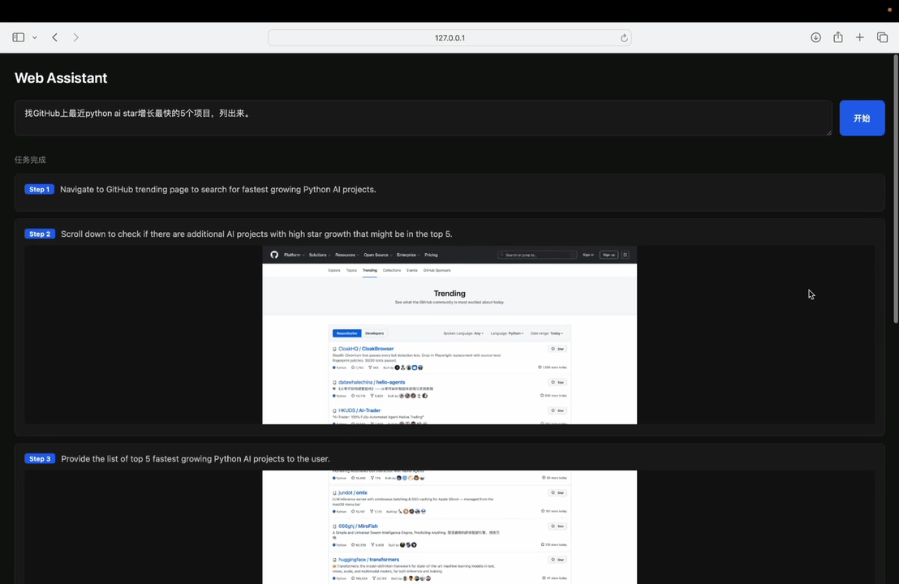
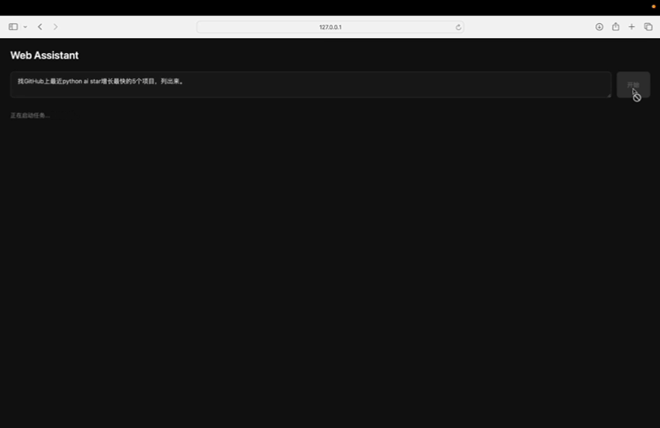
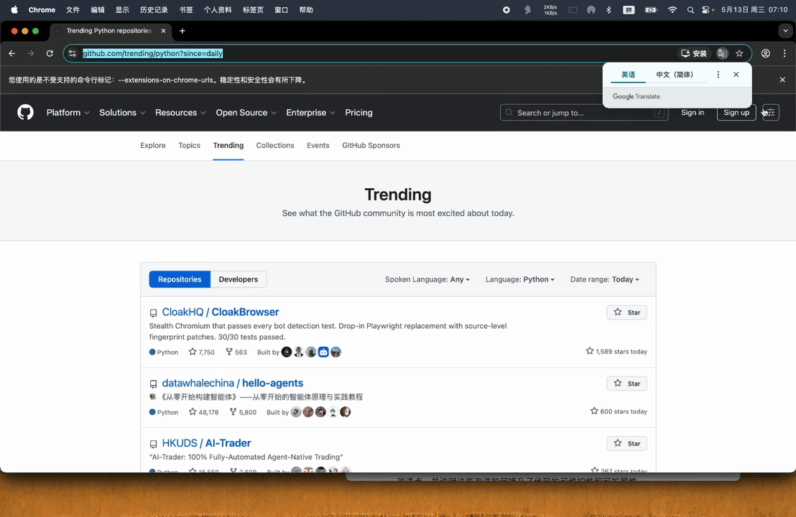

# Web Agent自动查找

> **自然语言 → 浏览器 Agent → 实时结果**

中文 | [English](README.md)

输入任务，看智能体一步步浏览网页，实时推送每步截图，最后返回结构化结果。

--- 

## 深度阅读

做这个项目前，我通读了 browser-use 源码并整理成文章：

**[→ browser-use 源码深度解析：一个 Web Agent 框架的工程落地实践](docs/browser-use-deep-dive.md)**

覆盖：Agent Loop 三阶段模型、DOM 三协议并行提取、Token 压缩机制、死循环检测、结构化输出可靠性、多标签页竞态处理。

---

## 踩坑记录

**browser-use 0.12.6 已从 LangChain 迁移到自己的 LLM 抽象层**（`browser_use/llm/`）。`Agent.__init__` 会校验 `llm.provider == "browser-use"`，LangChain 的 `ChatAnthropic` 没有 `provider` 属性，直接抛 `AttributeError`。解法：改用 `browser_use.llm.anthropic.chat.ChatAnthropic`。

**`BrowserStateSummary.screenshot` 已经是 base64 字符串**，不是原始字节。再套一层 `base64.b64encode()` 会二次编码，前端渲染出空白图片。

**`max_steps` 要传给 `agent.run()`**，不是 `Agent.__init__()`。传给构造函数会被 `**kwargs` 静默吞掉，没有任何报错，但完全不生效。

---


*完整演示：输入任务 → Agent 浏览 GitHub → 步骤时间轴实时截图 → 结构化结果输出。*

---

## 它能做什么

```
你：    "在 GitHub trending 找今天 Python 类目增长最快的 5 个项目"

Step 1  打开 github.com/trending?l=python          [截图]
Step 2  定位 trending 列表条目                     [截图]
Step 3  提取项目名、star 数、简介                   [截图]

结果：
  1. browser-use — Make websites accessible for AI agents  ★48.2k (+2.1k today)
  2. ...
```

Agent 在真实的 Chromium 浏览器里跑（通过 Playwright），由 Claude Sonnet 驱动决策。每一步通过 WebSocket 实时推送到前端，无需轮询，无需刷新。

---

## 技术栈

| 层 | 技术 |
|----|------|
| AI 决策 | Claude Sonnet via Anthropic API |
| 浏览器控制 | [browser-use](https://github.com/browser-use/browser-use) + Playwright + Chromium |
| 后端 | FastAPI + uvicorn |
| 实时通信 | WebSocket + `asyncio.Queue` |
| 前端 | 单文件 HTML + Vanilla JS |

没有 React，没有构建步骤，clone 即用。

---

## 快速开始

**环境要求：** Python 3.11+，[Anthropic API Key](https://console.anthropic.com/)

```bash
# 1. 安装依赖
pip install -e ".[dev]"
playwright install chromium

# 2. 配置 API Key
cp .env.example .env
# 编辑 .env → ANTHROPIC_API_KEY=sk-ant-...

# 3. 启动服务
uvicorn backend.main:app --reload --port 8000

# 4. 打开浏览器
open http://localhost:8000
```

---

## 架构

```
用户浏览器
  │  POST /api/task  → 创建任务，返回 task_id
  │  WS   /ws/{id}  → 建立 WebSocket，接收实时事件
  ▼
FastAPI  (backend/main.py)
  │
  ├── AgentManager  (backend/agent_manager.py)
  │     ├── asyncio.Queue  每个任务一个  ← producer/consumer 解耦
  │     ├── asyncio.Lock   保护任务状态写入
  │     └── register_new_step_callback → 将 StepEvent 压入 Queue
  │
  └── WebSocket handler  →  消费 Queue，推送 JSON 到前端

browser-use Agent  →  Chromium (CDP)
```

**关键设计决策：**

- `asyncio.Queue` 作为 producer/consumer 解耦层：WebSocket 晚于任务创建连接也不会丢事件
- `TaskState` 对象整体替换（非属性修改）+ `asyncio.Lock` — 避免并发读到中间状态
- Queue 末尾放 `None` sentinel，WebSocket handler 以此判断任务结束，干净退出
- `register_new_step_callback` 在 `Agent()` 构造时注入，不是装饰器
- `max_steps` 在 `agent.run()` 里传，不在 `Agent.__init__()` — 传给构造函数会被 `**kwargs` 静默吞掉

---

## WebSocket 事件契约

```
Server → Client

{ "type": "step",  "step": 3, "goal": "点击搜索按钮", "screenshot": "<base64>" }
{ "type": "done",  "result": "找到以下项目：..." }
{ "type": "error", "message": "..." }
```

所有 `type` 字段是 `Literal["step"|"done"|"error"]`，Pydantic 在构造时就拒绝非法值。

---

## REST API

```
POST /api/task
  Body:    { "task": "你的信息搜集任务" }
  Returns: { "task_id": "uuid" }

GET /api/task/{task_id}
  Returns: { "task_id": "...", "status": "running|done|failed", "result": "..." }
```

---


*任务提交：用自然语言描述需求，点击开始，Agent 在后台启动 Chromium 会话并立即执行。*


*Agent 实时浏览——真实的 Chromium 浏览器，由 Claude Sonnet 通过 Chrome DevTools Protocol 驱动。*

---

## 项目结构

```
web-search-pilot/
├── backend/
│   ├── agent_manager.py   # browser-use 封装 + asyncio.Queue 事件流
│   ├── config.py          # LLM 客户端工厂（单例 + lru_cache）
│   ├── main.py            # FastAPI：REST API + WebSocket + 前端服务
│   └── models.py          # Pydantic 数据模型：任务状态 + WebSocket 事件
├── frontend/
│   └── index.html         # 任务输入 + 步骤时间轴 + 结果展示
├── tests/
│   ├── conftest.py        # pytest fixtures（mock LLM，无需真实 API Key）
│   ├── test_agent_manager.py
│   ├── test_api.py
│   └── test_models.py
├── docs/
│   └── browser-use-deep-dive.md   # browser-use 源码深度解析
└── pyproject.toml
```

**跑测试（不需要 API Key）：**

```bash
pytest tests/ -v   # 20 个测试
```

---

## 路线图

**V0（当前）**
- [x] 信息搜集任务
- [x] 实时步骤截图推送
- [x] FastAPI + WebSocket 后端
- [x] 零构建单文件 HTML 前端

**V1（计划中）**
- [ ] 多 tab 并发信息搜集（Orchestrator + Executor 双层架构）
- [ ] 表单操作、登录流程
- [ ] 任务历史持久化
- [ ] React 前端 + 可视化 Agent 执行图
- [ ] 接入 MCP，动态发现外部工具
- [ ] DOM 提取失败时降级到 Vision 模型兜底

---

## License

MIT
